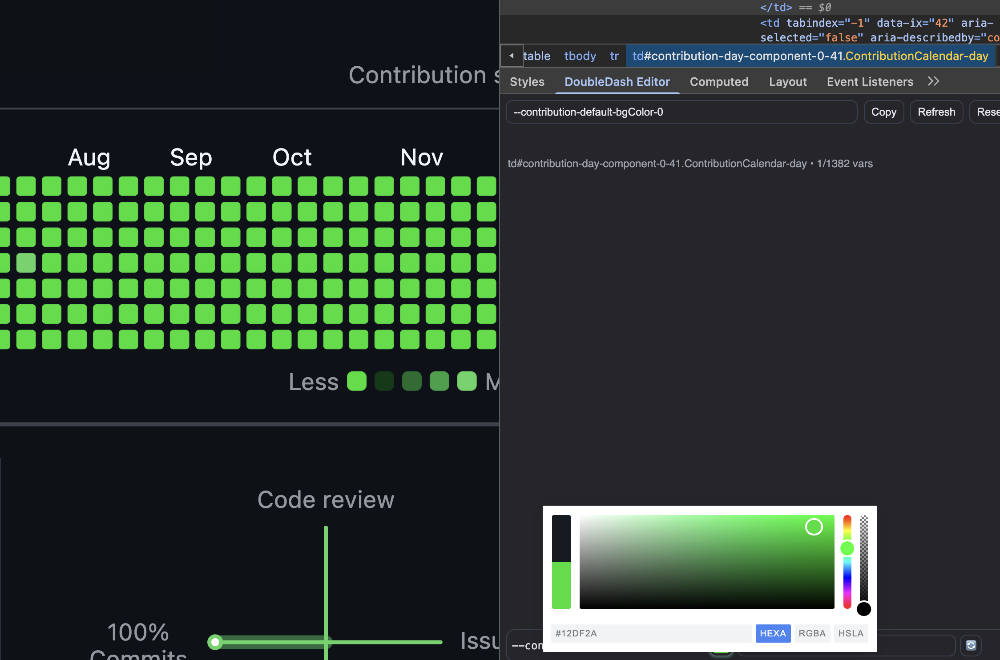

# DoubleDash Editor 

DoubleDash Editor is a DevTools Elements sidebar for fast CSS variable inspection and editing.
Simply light weight and fully open source.

> note: extra features are a WIP. Can enable them manually in [sidebar.js](./sidebar.js) or requested.

## Core Workflow
- Open **Elements** in Chrome DevTools.
- Open the **DoubleDash Editor** sidebar pane.
- Search variables by name (fuzzy) or value (substring).
- Use `Copy` to export the currently visible variable set as JSON.

 

